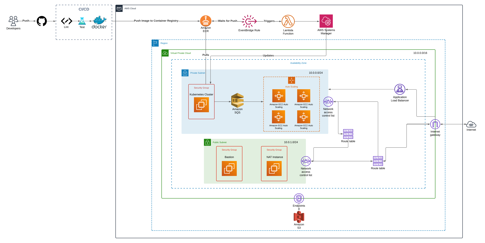

# AWS Architecture

## Overview

This architecture demonstrates a **CI/CD pipeline** integrated with **AWS services** **(_Free-Tier_ Only)** to build, test, and deploy containerized applications using a **Kubernetes** cluster hosted on AWS. It ensures automated scaling, secure networking, and efficient management of containerized workloads.

## Components

### 1. CI/CD Pipeline

- **Source Control (GitHub)**: Developers push code changes to a GitHub repository.
- **Linting and Testing:** The code undergoes linting and testing to ensure quality.
- **Docker Image Creation:** The pipeline builds Docker images of the application.
- **Amazon ECR:** The images are pushed to Amazon Elastic Container Registry (ECR) for storage and further deployment.

### 2. AWS Services for Deployment

- **EventBridge & Lambda:**
  - An EventBridge rule listens for image push events to Amazon ECR.
  - The rule triggers an AWS Lambda function, initiating the deployment process.
- **AWS Systems Manager:** Manages and automates various operations during the deployment, ensuring smooth and controlled updates.

### 3. Kubernetes Cluster (Custom EKS made with EC2)

- **Amazon EKS:** The Kubernetes cluster, hosted in a private subnet, pulls images from ECR for deployment.
- **Amazon SQS:** Acts as a message queue between services, ensuring asynchronous communication and job management.

### 4. Scaling & Load Balancing

- **Auto Scaling Group:** EC2 instances are auto-scaled based on load to maintain performance.
- **Application Load Balancer:** Distributes incoming traffic evenly across EC2 instances, ensuring high availability.

### 5. Networking & Security

- **Virtual Private Cloud (VPC):** Isolates the application within a secure network environment.
  - **Public Subnet:** Hosts the Bastion and NAT instances.
  - **Private Subnet:** Hosts the Kubernetes cluster, providing restricted access.
- **Security Groups:** Define rules for inbound and outbound traffic, securing the environment.
- **Network ACLs:** Additional layer of security controlling traffic at the subnet level.
- **Internet Gateway:** Enables communication between resources in the public subnet and the internet.
- **NAT Instance:** Allows instances in the private subnet to access the internet securely.

### 6. Storage & Endpoints

- **Amazon S3:** Stores static assets and application data.
- **VPC Endpoints:** Enable private connectivity to S3 without traversing the public internet.

## Workflow Summary

1.  Developers push code to GitHub.
2.  The CI/CD pipeline builds and tests the application, creating a Docker image.
3.  The image is stored in Amazon ECR.
4.  An EventBridge rule triggers a Lambda function upon image upload.
5.  The Lambda function manages deployment to the Kubernetes cluster.
6.  The Kubernetes cluster pulls the image from ECR and deploys it to the EC2 instances.
7.  The Application Load Balancer distributes traffic to the EC2 instances, ensuring high availability.
8.  Auto Scaling adjusts the number of instances based on the load.
9.  The application is accessible through the load balancer, and the architecture ensures secure communication and resource management.
